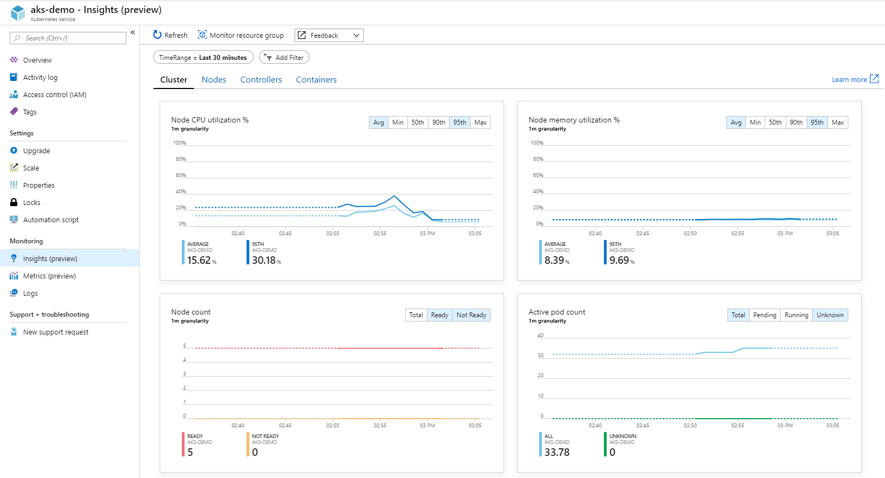
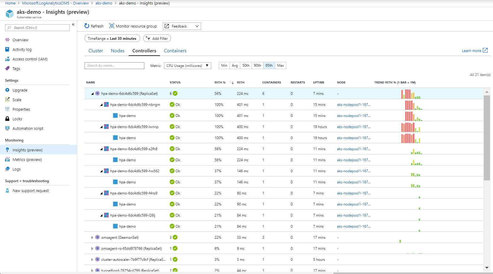
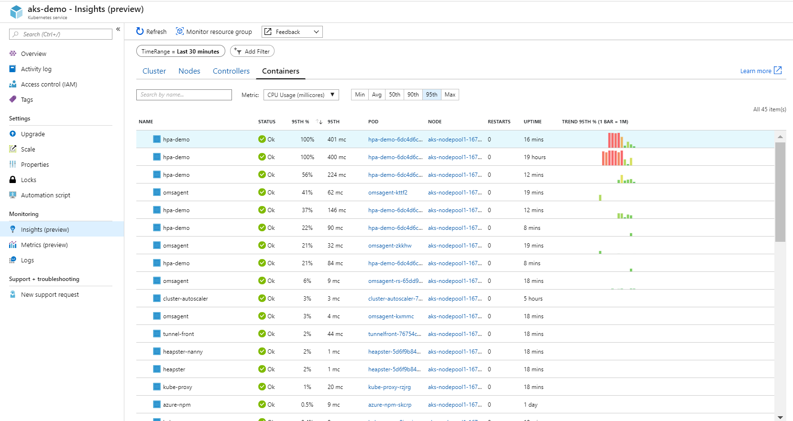
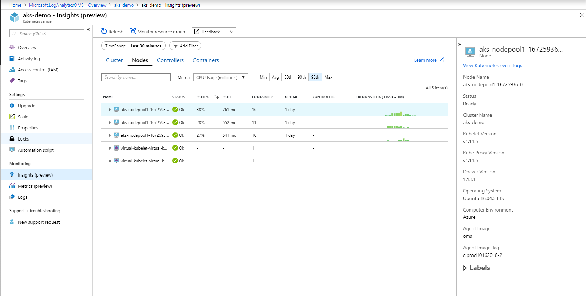
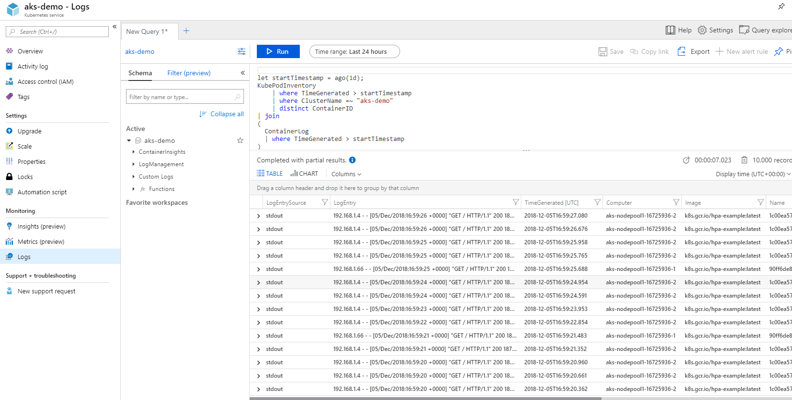

# Monitoring

We can monitor AKS using Azure Platform Resources, other community projects like Phometheus and Grafana, and third party tools available commercial or not.

## Enabling Azure Log Analytics

You can enable the Azure Log Analytics using the portal, by enabling the Logs and providing a Log Analytics Workspace.

To create a Log analytics Workspace check this [doc](https://docs.microsoft.com/en-us/azure/log-analytics/log-analytics-quick-create-workspace?toc=/azure/azure-monitor/toc.json).

To enable logs in AKS follow this [doc](https://azure.microsoft.com/pt-br/blog/monitoring-azure-kubernetes-service-aks-with-azure-monitor-container-health-preview/)

## Demo

After enabling the monitoring run the load test, from demo 7.

``` bash
../7-pod-scaling/load-test.sh 127.0.0.1 0 3
```

Go to Azure Portal and access monitoring -> insights.






